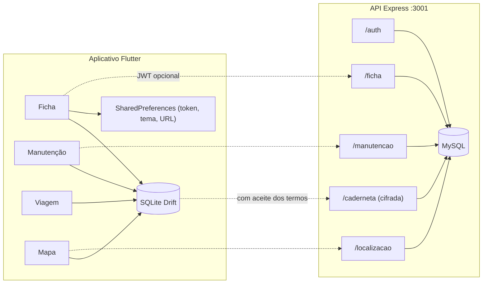

# Arquitetura, life.and.roads

## 1. Visão geral

Dois processos independentes. O aplicativo Flutter é a caderneta; a API Node.js é o cofre opcional.



A linha pontilhada só existe com conta. Sem login, nada sai do aparelho.

## 2. Camadas da API

Pasta `api/src/`, de fora para dentro. TypeScript em módulos (`auth`, `ficha`, `manutencao`, `localizacao`, `caderneta`, `monitor`) e `shared/`, que inclui a cifra da caderneta em `shared/cripto/`.

| Camada | Pasta | Responsabilidade |
|---|---|---|
| Transporte | `src/modules/*/*.routes.ts` | Verb + caminho |
| Validação | `*.schema.ts` + `shared/http/validador.ts` | Zod; ficha em `.strict()` |
| Autenticação | `shared/http/auth.ts` | Bearer access JWT |
| Caso de uso | `*.service.ts` | Regra de negócio |
| Persistência | `*.repository.ts` | SQL via `mysql2/promise` |
| Infraestrutura | `shared/` | Ambiente, pool, migrations, log, erros |

Controladores não acessam o banco. Repositórios não conhecem HTTP.

## 3. Módulos do aplicativo

```
app/lib/
  main.dart              quatro abas (IndexedStack)
  api.dart               cliente HTTP (JWT/refresh)
  core/api/openapi/      DTOs e cliente tipado do OpenAPI
  backup.dart            exportar / restaurar JSON
  tema.dart              paleta e ThemeData
  features/ficha/        domínio, dados, Riverpod da ficha/conta
  features/manutencao/   domínio, dados, Riverpod das datas
  features/viagem/       domínio, dados, Riverpod, use cases da rota/posto
  features/mapa/         domínio, dados, Riverpod, OSM isolado
  ficha/                 catálogo, foto, tela
  manutencao/            regras de data, km, lembretes, serviços, tela
  viagem/                fórmulas, histórico, tela
  mapa/                  GPS, rota, pins, destino, tela
```

As abas permanecem montadas (`IndexedStack`). Posto e Manutenção relêem a ficha ao ficarem visíveis, para a média e o km do painel recém-salvos valerem no cálculo. O abastecimento no Posto grava o km novo na ficha e avisa a Ficha para reler o aparelho, e a caderneta que chega da conta faz as quatro abas relerem.

## 4. O que é local e o que é remoto

| Dado | Local | API |
|---|---|---|
| Ficha (marca, modelo, km, tanque, km/l) | sim | sim, com conta |
| PSI | sim | na caderneta cifrada |
| Foto | sim | não |
| Óleo, pneus, revisão, IPVA, seguro, licenciamento | sim | sim (datas) |
| Km de óleo/corrente, CNH, serviços | sim | na caderneta cifrada |
| Preço do litro, abastecimentos | sim | na caderneta cifrada |
| Pins | sim | na caderneta cifrada |
| Arquivo de backup | sim | não |
| Último ponto GPS | sim | sim, com conta |

"Na caderneta cifrada" vale com conta, aceite dos termos e o interruptor ligado, e vai por `/caderneta` (ADR 0038).

## 5. Fórmulas

Consumo no posto.

\[
km/l = \frac{km_{painel} - km_{ficha}}{litros}
\]

Custo da viagem.

\[
litros = \frac{km_{rota}}{km/l},\quad reais = litros \times preço_{litro}
\]

Custo por quilômetro.

\[
R\$/km = \frac{litros \times preço_{litro}}{km_{rodados}}
\]

Autonomia.

\[
km_{autonomia} = tanque_{L} \times km/l
\]

Flex na bomba compara `preço / km/l` de gasolina e de álcool. O menor R$/km vence.

Papelada anual (IPVA, seguro, licenciamento) soma um ano até a data ficar no futuro. CNH soma 10 anos (ou 5, se marcado). Óleo, última data + 6 meses. Pneus, + 12 meses.

## 6. Persistência local

Caderneta (ficha, foto, agenda, extra, preços, último ponto, históricos, pins e metadados de sync): SQLite (Drift), arquivo `caderneta.sqlite`. Schema v2: tabela `caderneta_kv` para o que era JSON nas prefs.

Na primeira abertura, as chaves `abastecimentos_v1`, `servicos_v1`, `pins_v1`, `ficha_moto_v1`, `manutencao_v1`, `manutencao_km_v1`, `foto_moto_v1`, `preco_litro_v1`, `preco_alcool_v1`, `ultimo_ponto_v1` e `manutencao_sync_v1` migram para o banco e somem das prefs.

SharedPreferences (prefixo `flutter.` na Web) fica só com e-mail e aparência:

- `tema_v1`
- `email_life_and_roads`
- `api_base_v1` (override do campo Servidor)

Access e refresh (`token_life_and_roads`, `refresh_life_and_roads`) ficam no `flutter_secure_storage` via `SessaoSegura`, que migra o valor antigo das prefs na primeira leitura. Quem precisa saber se há conta pergunta à `SessaoSegura`, nunca às prefs.

URL padrão da API: `--dart-define=API_BASE=https://...`. Sem define: `http://localhost:3001`.

Backup JSON: versão 2 (listas estruturadas); a restauração ainda lê a versão 1. Ver [sincronizacao.md](sincronizacao.md).

## 7. Segurança da API

- Helmet, CORS explícito, limite de 20 kb no JSON
- 300 requisições / 15 min por IP (`/health` livre)
- Senha com bcrypt (custo 10)
- JWT access nas rotas de ficha, manutenção e localização
- Refresh de uso único com rotação. Reuso dentro de 15 s é retry das abas; fora disso é roubo e derruba a conta (ADR 0017). Sair e troca de senha revogam sem punir os outros aparelhos. Sessões vencidas são apagadas no boot e uma vez por dia
- Exclusão em `DELETE /auth/conta`
- Schema Zod recusa placa, chassi, RENAVAM e qualquer campo não listado
- Erro do `express.json()` (JSON quebrado, corpo grande) responde 400/413, não 500
- `TRUST_PROXY` diz quantos proxies há na frente (Render 1, compose 0). Sem isso, `X-Forwarded-For` falso escapa do rate limit

## 8. Serviços de terceiros

| Serviço | Uso | Condição |
|---|---|---|
| OSRM público (`router.project-osrm.org`) | km de estrada em `mapa/rota.dart` | Servidor de demonstração, sem garantia e sem uso comercial. Serve para o beta. Para loja, hospedar um OSRM próprio ou trocar por um provedor com contrato |
| OpenStreetMap (`tile.openstreetmap.org`) | tiles do mapa em `camada_osm.dart` | Sem chave, com User-Agent do app e atribuição "© OpenStreetMap" (política de uso do OSM: tráfego moderado, sem pré-download em massa). A CARTO foi trocada em 18/09/2026 porque passou a exigir chave. Tema escuro por inversão de cores no cliente. Para loja, tiles próprios ou provedor com contrato |
| Resend (`api.resend.com`) | envio do código de recuperação de senha em `shared/email/enviar_email.ts` (ADR 0029) | Recebe o endereço de e-mail da conta e o código de 6 dígitos, só quando alguém pede `POST /auth/recuperar` para um e-mail com conta. Chamada HTTPS com `fetch`, sem SDK. A rota `POST /auth/recuperar` responde sem esperar o envio terminar; falha do Resend vai para o log. Precisa de `RESEND_API_KEY` no Render e do domínio `raulnikroyce.dev` verificado no Resend. Sem a chave, a rota responde 503 em produção e, fora dela, o código vai para o log |

OSRM e OpenStreetMap têm timeout e caem para "sem rota" ou mapa vazio. A caderneta não depende deles. O Resend só entra na recuperação de senha; sem ele, essa rota responde 503 e o resto da API segue.
